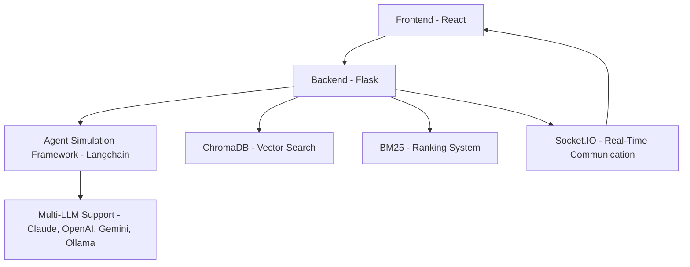

# 🎯 **InstaPolitics**  

## 🚀 **Inspiration**  
Social media is reshaping modern politics, and InstaPolitics was born to explore that connection! The idea was to create a hands-on simulation where students, especially those in business, education, and political science, can study how politicians sway voters through social media. With InstaPolitics, you can see how political figures craft messages, influence public opinion, and ultimately shape election outcomes in real-time.

---

## 🌍 **What It Does**  
InstaPolitics is a full-stack web app that simulates the complex dynamics of political campaigns and voter behavior.  

- 🏛️ **Politician Agents**: Define unique personalities for political figures, who will post on a custom-built social media platform.  
- 👥 **Citizen Agents**: Voters react to posts based on their personalities and biases.  
- 🎯 **Influence and Decision-Making**: Watch how posts influence voters and drive decisions at the ballot box.  
- 📊 **Real-Time Simulation**: See political strategies unfold and voter behavior evolve in real-time.  
- ✨ **Goal**: To understand how social media shapes modern political influence through direct interaction and dynamic feedback.  

---

## 🛠️ How I Built It
Here's the full-stack architecture breakdown:  

## 🛠️ **Tech Stack**  

| **Component** | **Tech Used** | **Purpose** |
|-------------|---------------|------------|
| **Frontend** | React, MaterialUI, Socket.IO | Responsive UI, real-time updates |
| **Backend** | Flask, Python | State management, API handling |
| **Agent Framework** | Customer Framework over Langchain | Decision-making and content generation for agents |
| **Search** | ChromaDB, BM25 | Vector search and ranking for relevance |
| **LLM Support** | Claude, OpenAI, Gemini, Ollama, Groq | Generating realistic political content |
| **Real-Time Communication** | Socket.IO | Live updates and interactions |
| **Data Storage** | ChromaDB | Storing embeddings for agent memory and search |
| **Ranking** | BM25 | Ranking social media posts based on influence |

### 🌐 Frontend
---
Built with React for a responsive and interactive UI.

Real-time updates using WebSockets for seamless communication.

### 🔥 Backend
---
Developed using Python + Flask to handle API requests and state management.

Custom APIs for managing agents, scenarios, and user interactions.

### 🧠 Agent Simulation
---
Created a custom agentic framework using Langchain.

Politician and citizen agents make decisions based on personalities and content.

### 🔍 Search and Ranking
---
ChromaDB for vector storage and similarity matching.

BM25 for ranking posts based on relevance and influence.

### 📡 Real-Time Interaction
---
Socket.IO for real-time updates—see how voter decisions change instantly!

### 🤖 LLM Integration
---
Multi-LLM support with Claude, OpenAI, Gemini, Ollama, and Groq.

Diverse language models generate realistic political content and responses.

## ⚔️ Challenges I Faced
---
Custom Agentic Framework

First time building a complex agent framework from scratch—had to make sure agents responded naturally to social media content.

- Balancing Personalities

> Making sure politician and voter personalities felt realistic and consistent.

- Real-Time Data Handling

> Optimizing backend and socket performance to handle simultaneous agent interactions.

- Ranking Complexity

> Fine-tuning BM25 to rank posts accurately based on voter preferences.

## 🏆 Accomplishments I'm Proud Of
✅ Built a dynamic simulation where agents' personalities drive meaningful political discourse. \
✅ Achieved real-time updates with seamless socket communication. \
✅ Developed a custom social media platform where agents interact authentically. \
✅ Created a system where different LLMs generate diverse and realistic content. \

## 🎓 What I Learned
📌 Agent-Based Simulation: Learned to model realistic agent behavior based on personalities. \
📌 Real-Time Data Management: Mastered data synchronization across frontend and backend. \
📌 LLM Integration: Understood how to combine outputs from different LLMs. \
📌 Search and Ranking: Gained expertise in BM25 and vector-based search using ChromaDB. \

## 🚀 What's Next
💡 Enhanced Agent Personalities – Add deeper emotional and behavioral traits. \
📊 Advanced Analytics – Track how different strategies influence voter behavior over time. \
🎮 Multiplayer Mode – Let multiple users run campaigns and compete for voter influence. \
📝 AI-Generated Content – Use more advanced AI to create diverse, nuanced political posts. \
📱 Cross-Platform Deployment – Bring InstaPolitics to mobile using Flutter (yes, I might have to learn Flutter for this 😎). \

## 🎯 Why InstaPolitics Matters
InstaPolitics isn’t just a game—it’s a political sandbox where students can experiment, analyze, and learn how modern political influence works. Social media has changed politics forever, and InstaPolitics gives you a front-row seat to that transformation.
